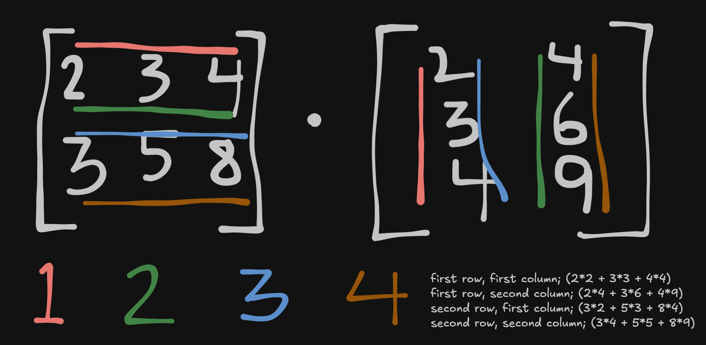

# Machine Learning

## Essential Terms & Concepts

**Cost** - a measure of the efficacy of the algorithm with respect to a goal; it may be defined as `number_of_errors / number_of_predictions`; a cost of 1.0 is the worst cost for a model; a cost of 0.0 is an optimal cost; said differently, a model with a 0.0 cost has made predicted correctly based on its inputs/training data

Cost is the means by which we inform a model of its efficacy. As a model iterates based on training data, it consumes this cost metric to inform its growth/progress.

**Neural Network** - uses multiple computation units (neurons to follow the metaphor) which we call **parameters**; if we are trying to replicate the machinery and process of a brain, we wants lots and lots of parameters and a single function to execute it.

>**__NOTE TO SELF__**: Regarding the idea of a single function handling so many parameters, I assume this means massive parallelization and concurrency to make these computations feasible in realistic timeframe or something with lots of cool maths.

**Scalar** - a single element of the simplest type like an integer, float, character; a non-compound type; in the context of ML, mathematics and matrix multiplication, it means a single numeric value (i.e. integer)

**Vector** - a list of numbers; in JS would be represented as an Array, e.g. [1,4,3]

**Matrix** - a table of number which could be represented by a list or array of two dimensions, e.g. [ [1,2,3], [4,5,6], [7,8,9] ]; matrices are described by their dimensionality; a matrix with two rows and two columns is a 2x2 matrix; a matrix with 5 rows and 4 columns is a 5x4 matrix

**Matrix Multiplication** - in order for matrices to be compatible for a dot product, they must follow the format __a*b • b*c__ where the resultant matrix will have dimensions __a*c__; this is often referred to as the **dot product** of two matrices; see figure below

